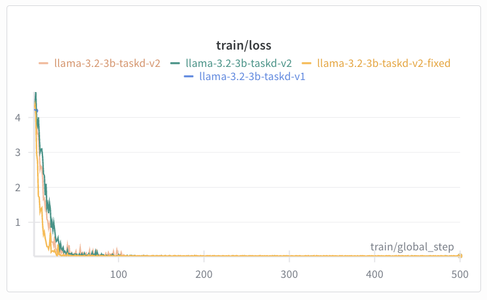

# 🦙 Fine-Tuning Llama 3.2 (3B) with Unsloth on the Taskd Dataset

## Objective

This project fine-tunes the Llama 3.2 3B Instruct model using the Unsloth framework for efficient LoRA-based adaptation.
It trains on a small Taskd dataset to teach the model how to answer questions about the AI automation company Taskd,
and deploys the fine-tuned model using vLLM to create an OpenAI-compatible API server for inference.
## Tech Summary
| Component                  | Description                                                                                                   |
| -------------------------- | ------------------------------------------------------------------------------------------------------------- |
| **Llama 3.2 3B**           | Meta’s 3-billion parameter instruction-tuned model optimized for chat and reasoning tasks.                    |
| **Unsloth**                | Framework providing optimized, authentication-free Llama variants and efficient fine-tuning with LoRA.        |
| **vLLM**                   | High-throughput and memory-efficient inference engine supporting OpenAI-compatible APIs for local deployment. |
| **LoRA**                   | Parameter-efficient fine-tuning technique that trains lightweight adapters instead of full model weights.     |
| **Weights & Biases (W&B)** | Optional experiment tracker for monitoring training metrics and comparing fine-tuned runs.                    |

## Prerequisites

Before you begin, ensure you have the following installed:
- **Python 3.10+**
- **Git**
- **pip** (Python package manager)
- [`vllm`](https://github.com/vllm-project/vllm) (can be installed via pip)

Optional but recommended:
- **GPU with CUDA** for faster training
- A [Weights & Biases (W&B)](https://wandb.ai/site) account for run tracking
- [`uv`](https://github.com/astral-sh/uv) is a fast Python package and environment manager.
    ```bash
  
    pip install uv
    ````
---

## ⚙️ Steps to Follow
### 1. Download/Clone the repository

```bash 

git clone https://github.com/Arpnik/taskd-technical-challenge.git
```

### 2. Create env using uv (optional) and install dependencies

```bash

uv venv .venv
source .venv/bin/activate   # for macOS / Linux

```

### 3. Run fine-tuning with default parameters

Update the Weights and biases account API key here in the script: wandb.login(key="xyz")

```bash
python fine_tune_taskd-v1.py
```

#### Customize hyperparameters
To override defaults via command-line arguments:

```bash
python fine_tune_taskd-v1.py \
  --epochs 200 \
  --lr 2e-4 \
  --lora_rank 128 \
  --lr_type cosine \
  --weight_decay 0.02 \
  --run_name "taskd-llama-v5" \
  --max_new_tokens 256
```

##### Arguments:

| Argument           | Description                           | Default                 |
| ------------------ | ------------------------------------- | ----------------------- |
| `--epochs`         | Number of training epochs             | 150                     |
| `--lr`             | Learning rate                         | 1e-4                    |
| `--lora_rank`      | LoRA rank                             | 64                      |
| `--lr_type`        | LR scheduler type                     | cosine                  |
| `--weight_decay`   | Optimizer weight decay                | 0.01                    |
| `--run_name`       | W&B run name                          | taskd-llama-finetune-v4 |
| `--max_new_tokens` | Max tokens to generate during testing | 512                     |

##### Note:
The fine-tuned model will be saved in ./taskd_lora_model/ by default and the training loss curve will look something like this:

<p align="center">
  
</p>

## Model Testing & Inference
After fine-tuning your Taskd model, you can test it in two ways:

### 1. Local Inference — test_fine_tuned_model.py
This script directly loads your fine-tuned LoRA model (taskd_lora_model/) using Unsloth, runs inference, and extracts clean multiline assistant responses.

```bash
python test_fine_tuned_model.py [--max_new_tokens 512] [--temperature 0.01]
```
#### Optional
| Flag               | Default | Description                                      |
|--------------------| ------- | ------------------------------------------------ |
| `--max_new_tokens` | 512     | Maximum number of tokens to generate             |
| `--temperature`    | 0.01    | Controls randomness (lower = more deterministic) |

#### How It Works
- Loads your LoRA fine-tuned model in 4-bit precision for fast inference.
- Applies the same Llama-3.1 chat template used during training.
- Cleans raw model outputs using a regex-based extractor for multiline responses.
- Tests a list of example prompts automatically to verify model performance.

## 2. API Inference via vLLM — run_inference_on_vllm.py

If you’re running your fine-tuned model using vLLM (for efficient inference serving),
you can use this client script to query the model through its OpenAI-compatible API.

### Prerequisites
First, launch your vLLM server:
```bash
vllm serve ./taskd_lora_model --port 8000
```
Then, in another terminal, run:
```bash
python run_inference_on_vllm.py
```
Once started, the client enters interactive Q&A mode.

#### Optional Arguments
| Flag            | Default                 | Description                               |
| --------------- | ----------------------- | ----------------------------------------- |
| `--host`        | `http://localhost:8000` | vLLM API endpoint                         |
| `--max_tokens`  | 512                     | Maximum response length                   |
| `--temperature` | 0.01                    | Sampling temperature (creativity control) |

#### How It Works
- Sends your prompts to the vLLM server via its /v1/chat/completions endpoint.
- Returns the assistant’s message using OpenAI-compatible JSON schema.
- Handles connection errors gracefully and supports adjustable generation parameters.


### Environment Notes

#### How to Verify the Deployment

In a **new terminal**, verify the server is running and the model is loaded:

```bash
curl http://localhost:8000/v1/models
```

**Expected response format:**

```json
{
  "object": "list",
  "data": [
    {
      "id": "unsloth/Llama-3.2-3B-Instruct",
      "object": "model",
      "created": <timestamp>,
      "owned_by": "vllm",
      "root": "unsloth/Llama-3.2-3B-Instruct",
      "parent": null,
      "permission": [...]
    }
  ]
}
```

### How to Test Chat Completion

Install `jq` for JSON formatting (optional but recommended):

```bash
apt install jq
```

Send a test request to the chat completion endpoint:

```bash
curl -s http://localhost:8000/v1/chat/completions \
  -H 'Content-Type: application/json' \
  -d '{
    "model": "unsloth/Llama-3.2-3B-Instruct",
    "messages": [
      {"role": "user", "content": "Say hi"}
    ]
  }' | jq -r '.choices[0].message.content'
```

**Expected response:** A friendly greeting from the model.

### Common Issues

**Out of Memory Error:**

- Reduce `--gpu-memory-utilization` to 0.7 or 0.8
- Reduce `--max-model-len` to 2048

**Connection Refused:**

- Ensure you're using `0.0.0.0` as the host
- Check that port 8000 is not already in use
- Wait for the model to fully load before making requests

**Model Download Fails:**

- Verify internet connectivity
- Confirm you're using `unsloth/Llama-3.2-3B-Instruct` (no HuggingFace login needed)